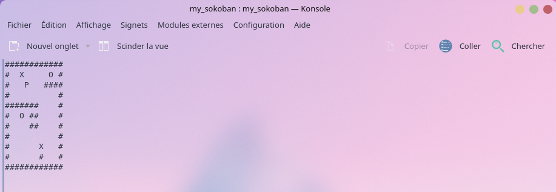

MY_SOKOBAN

Description : 

Ce projet reprend le celèbre jeux du Sokoban directement dans le terminal de votre machine grâce à la librairie ncurses ! 




Installation et Exécution :
  Prérequis
> GCC Compiler
> NCURSES LIBRARY


Instructions : 


1 > Clonez le répertoire

```git clone git@github.com:Yasl290/my_sokoban.git```


2 > Compilez le Projet


```make```

3 > Exécutez le Simulateur

```./my_sokoban bonus/map.txt```


Libre à vous de vous amuser sur vos maps personnalisés en créeant des fichiers avec la map dedans puis de l'executer en paramètre du programme : ./my_sokoban map_perso.txt
